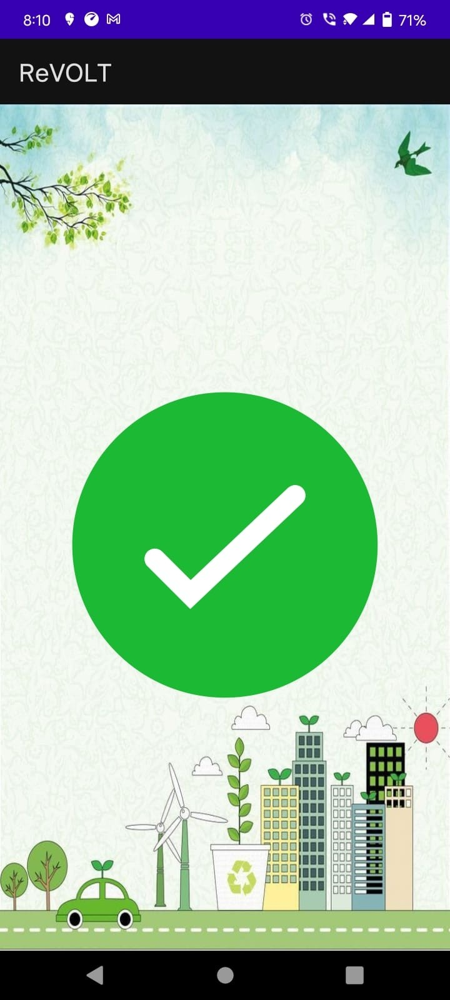
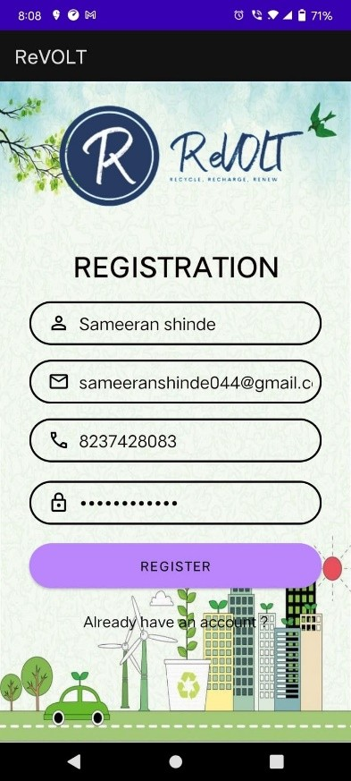
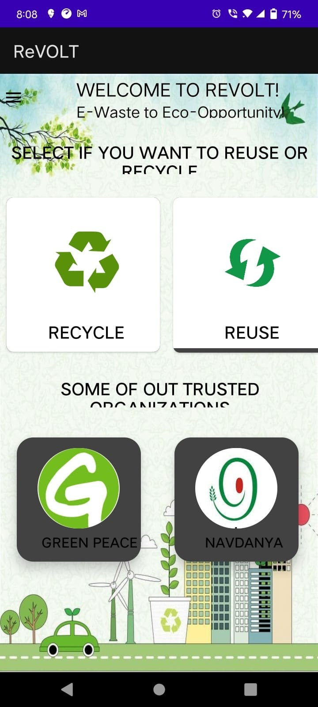
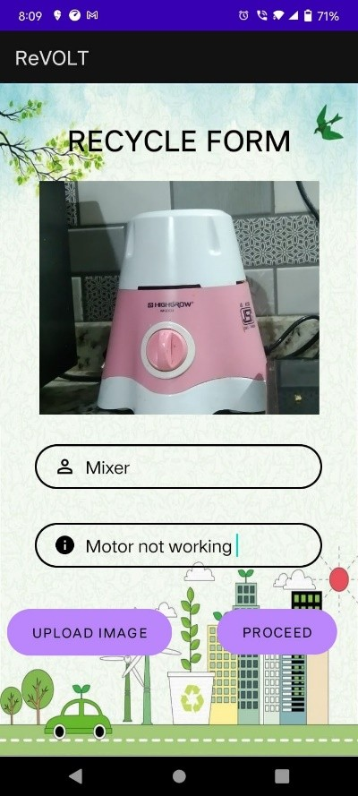
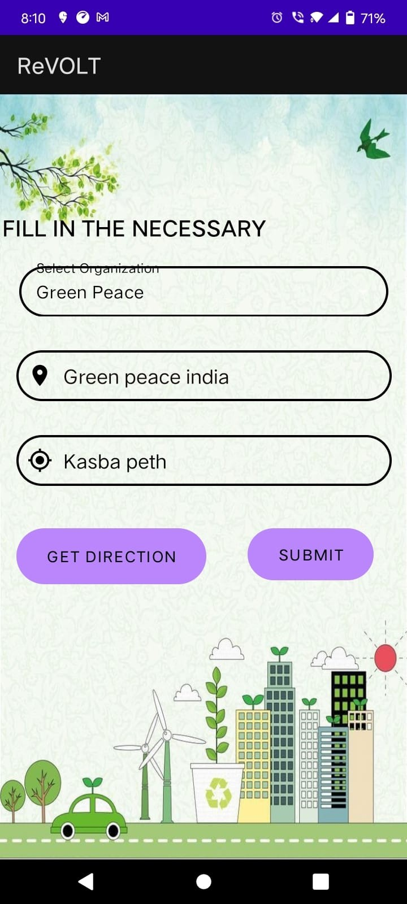
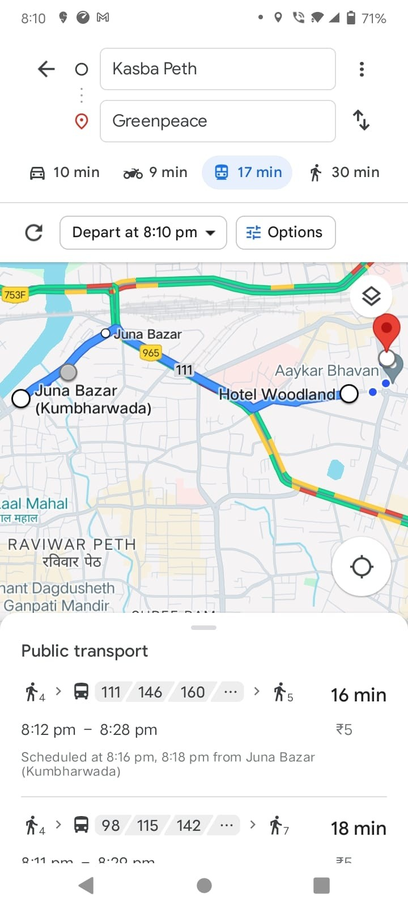

--------------------------------------------------------------------------------------------------------------------------------------

## ReVOLT: Turning E-Waste into Sustainable 🌱

**ReVOLT** is a project focused on reducing electronic waste (e-waste) by collecting, recycling, and reusing old electronic devices. The main aim is to protect the environment and promote sustainability.

---------------------------------------------------------------------------------------------------------------------------------------

## AIM OF THR PROJECT

To build a simple system that helps in:

* Collecting old electronic items
* Recycling or repairing them
* Reusing valuable parts in new ways

---------------------------------------------------------------------------------------------------------------------------------------

## WHAT THE PROJECT DOES

* Lets people register their e-waste for pickup or drop-off
* Tracks the type and amount of e-waste collected
* Helps extract useful materials like copper or gold from old electronics
* Reuses working parts for new devices or donations
* Spreads awareness about e-waste and how to manage it properly

---------------------------------------------------------------------------------------------------------------------------------------

## TECH STACK USED

* **Frontend:** XML
* **Backend:** Java

---------------------------------------------------------------------------------------------------------------------------------------

## HOW IT WORKS

1. User logs in or signs up
2. Adds details of the device they want to recycle
3. System shows collection/drop-off status
4. Collected devices are sorted
5. Usable parts are reused or recycled
6. System shows reports and progress

---------------------------------------------------------------------------------------------------------------------------------------

## PROS OF THE PROJECT

* Helps reduce e-waste
* Protects the environment
* Promotes recycling and reuse
* Creates awareness in the community

---------------------------------------------------------------------------------------------------------------------------------------

## FLOWCHART OF THE PROJECT

---------------------------------------------------------------------------------------------------------------------------------------

## SCREENS OF THE PROJECT

---------------------------------------------------------------------------------------------------------------------------------------